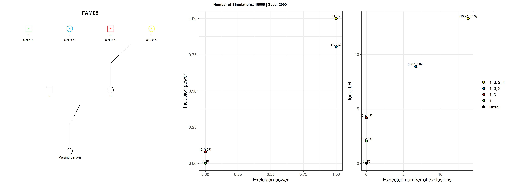

# 🧬 PedigreeOverTime

--------------------------------------------------------------------------------

## 🔍 Introduction

**PedigreeOverTime** is an R pipeline—purpose-built for **MPI (Missing Person Identification)** and **DVI (Disaster Victim Identification)** workflows—that reads a _.fam_ file and visualizes, in chronological order, how adding specific members typed by **STR** or **SNP** markers to each pedigree improves statistical power in kinship analysis.  
Leveraging parallel computing, the pipeline runs large EP/IP simulations efficiently. Using a companion spreadsheet of genotyping dates, it produces annotated pedigree diagrams and simulation-based **Exclusion Power** (EP) and **Inclusion Power** (IP) metrics, clearly showing when—and by how much—each new sample boosts identification confidence.

--------------------------------------------------------------------------------

## 🚀 Key Features

- **Automatic data ingestion**  
  * Reads a single multi-family _.fam_ file (MPI/DVI ready) via `pedFamilias::readFam()`.  
  * Auto-detects the companion Excel timeline and validates the required columns.

- **Chronological pedigree evolution**  
  * Adds newly typed STR/SNP members in timestamp order, storing every intermediate pedigree state.  
  * Automatically flags pedigrees with new members or missing outputs and schedules them for re-simulation.

- **High-throughput power simulation**  
  * Computes **Exclusion Power (EP)** and **Inclusion Power (IP)** with `missingPersonEP()` and `missingPersonIP()`.  
  * Parallelised via **future + furrr**—utilises all but one CPU core by default.

- **High-resolution visualisation**  
  * Produces annotated pedigree diagrams showing typed members and their genotyping dates.  
  * Builds dual panels (EP vs IP and Expected Mismatch vs log-LR) and merges them into a single JPEG per family.

- **Clean, reproducible outputs**  
  * Saves every intermediate pedigree, EP object, and IP object as RData files.  
  * Organises all figures in a tidy `output/` directory tree for easy review and sharing.
 
--------------------------------------------------------------------------------

## 📋 Requirements

- **Genetic Data**: To perform the simulations, it is necessary to
    have a pre-configured `Familias3` file containing the _Frequency Table_ (STR/SNP) 
    and _Family Pedigrees_. 
    To install the required software, go to this link: [Familias3](https://familias.no/)

- **Genotyping Date Data**: A spreadsheet listing each family group (`Pedigree`)—which matches the pedigree name defined in the Familias file—and the internal member identifier (`Member_id`)—which corresponds to the individual’s ID within that pedigree—along with the date on which that individual was genotyped (`Typed_date`). 
This timeline drives the step-wise incorporation of samples into each pedigree for plotting and simulation.

    | Pedigree | Member_id | Typed_date |
    |----------|-----------|------------|
    | FAM01    | 1         | 15/2/2025  |
    | FAM02    | 2         | 7/12/2024  |
    | FAM02    | 5         | 12/1/2025  |
    | FAM03    | 1         | 9/9/2024   |
    | FAM04    | 2         | 15/11/2024 |   

- **R version 4.2.0 or higher**.

--------------------------------------------------------------------------------

## 🛠 Installation & Setup

1. **Clone the repository**
   ```bash
   git clone https://github.com/sbiagini0/PedigreeOverTime.git
   cd PedigreeOverTime
   ```
2. **Open the project in RStudio**
    - Double-click on `PedigreeOverTime.Rmd`.

3. **Install the required packages**
    - Run the first code chunk in PedigreeOverTime.Rmd; it detects missing libraries, installs them, and loads them.
    To install manually:
   ```bash
   install.packages(c("pedtools", "forrel", "furrr", "purrr", "tidyverse", "dplyr", "magick", "grid", "gridExtra", "ggplot2", "readxl", "here"))
   ```

--------------------------------------------------------------------------------
  
## ⚙️ Configuring and Running the Simulation

1. **Prepare your input files**
    - Place a _DVI/MPI_ `.fam` file in the `data/` folder (any filename).
    - Place an Excel `.xlsx` in `data/` containing the columns
      `Pedigree`, `Member_id`, and `Typed_date` (any filename).

2. **Set key parameters**
    - Set `threshold` for the LR cut-off used in EP vs. IP plot.  Matches are counted only when the simulated likelihood-ratio        exceeds this value  
    - Set the `nsims` parameter (number of simulations).  
        - A higher `nsims` gives more precise **EP/IP** estimates but increases runtime.  
        - For a quick test, try `nsims <- 100`; for full analyses, you might choose `nsims <- 10000` or             more depending on your hardware.
    - Set `ncores` (number of parallel workers), use one fewer than your total cores to keep the system         responsive.
    - Set the single started seed for fixed reproducible results.
        - The pipeline assigns that seed to the first pedigree and then increments it for each subsequent           pedigree, giving every family a fixed —but distinct—random state while keeping the whole run              reproducible.
    
    **Main function**
    
    ```r
    simulatePedigreeOverTime(
      df        = df,
      pedigree  = mpi,
      threshold = 10000,
      nsims     = 10000,
      ncores    = 4,
      seed      = 2000,
      path      = path_info
    )
    ```

3. **Run all chunks in order**
    - The script auto-detects which pedigrees are new or need updating.
    
4. **Review outputs**
  - The `output/` folder contains the following subdirectories and files for each _Family Pedigree_:
 
    - **Pedigree plot/**: JPEG images showing the pedigree structure annotated with genotyping dates.  
    - **Simulation plot/**: JPEG panels depicting EP vs IP and Expected Mismatch vs Log(LR) for each simulation run.  
    - **EP/** and **IP/**: RData files with raw simulation results for **Exclusion Power** and **Inclusion Power**, respectively.  
    - **RData peds/**: Saved RData objects of all intermediate pedigree versions.  
    - **Final Images** (`output/<Pedigree>.jpeg`): Combined side-by-side images of the pedigree plot and simulation results.

--------------------------------------------------------------------------------

## 🖼️ A toy MPI example

The `toy_MPI.fam` file included in this repository is a simplified
example representing a basic scenario of genetic pedigree.
This file includes a **Population Frequency Table** from South America with 24 STR markers, with 15 Family Pedigrees to be evaluated.



--------------------------------------------------------------------------------

## 📚 Citations

### mispitools package
- **Marsico et al.** (2023). *Forensic Science International: Genetics*. https://doi.org/10.1016/j.fsigen.2023.102891  
- **Marsico et al.** (2021). *Forensic Science International: Genetics*. https://doi.org/10.1016/j.fsigen.2021.102519  
- **Marsico** (2024). *bioRxiv*. https://doi.org/10.1101/2024.08.16.608307

### pedsuite package (pedtools, forrel)
- **Vigeland, M. D.** (2020). *Pedigree Analysis in R*. Academic Press. https://doi.org/10.1016/C2020-0-01956-0

--------------------------------------------------------------------------------

## 📝 License

MIT License — see [LICENSE](LICENSE) for details.

--------------------------------------------------------------------------------
